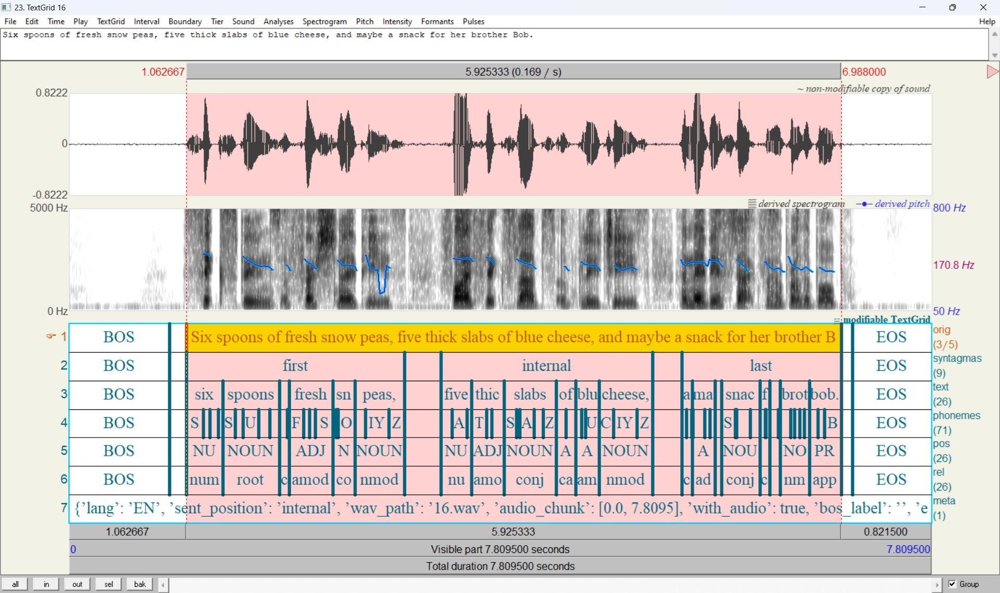

# SpeechFlow

A speech processing toolkit focused on easy configuration of complex speech data preparation pipelines and rapid prototyping of speech synthesis models (TTS).

The goal of this project is to provide a comprehensive toolkit to solve the TTS problem, including a [multilingual frontend](https://github.com/just-ai/multilingual-text-parser) for text preparation, forced alignment models, and a framework for assembling various TTS systems from unified blocks.

### Installation

0. Clone a repository

```
git clone https://github.com/just-ai/speechflow
cd speechflow && git submodule update --init --recursive -f
```

#### On Ubuntu:

1. Installation system packages

```bash
apt-get update
apt-get install -y libssl1.1
apt-get install -y g++
apt-get install -y wget sox ffmpeg
```

2. Installation Python 3.10 with conda environment

```bash
conda create -n py310 python=3.10
conda activate py310
# source /opt/conda/etc/profile.d/conda.sh && conda activate py310
```

3. Installation [PyTorch](https://pytorch.org/) and python requirements

```bash
pip install torch torchvision torchaudio
pip install -r requirements.txt
```

4. Installation requirements for [multilingual frontend](https://github.com/just-ai/multilingual-text-parser)

```bash
# install dotnet
wget https://packages.microsoft.com/config/ubuntu/20.04/packages-microsoft-prod.deb -O packages-microsoft-prod.deb
dpkg -i packages-microsoft-prod.deb
rm packages-microsoft-prod.deb

apt-get install -y apt-transport-https && apt-get update
apt-get install -y dotnet-sdk-5.0
apt-get install -y aspnetcore-runtime-5.0
apt-get install -y dotnet-runtime-5.0
apt-get install -y nuget

# install eSpeak
apt-get install -y espeak-ng
```

5. Installation submodules

```bash
sh libs/install.sh
```

6. Run tests

```bash
pytest tests
```

#### On Windows:

1. Install [Python 3.10](https://repo.anaconda.com/miniconda/Miniconda3-py310_24.5.0-0-Windows-x86_64.exe)
2. Installations additional dependencies:
[.NET 5.0](https://dotnet.microsoft.com/en-us/download/dotnet/5.0),
[C++ Build Tools](https://visualstudio.microsoft.com/ru/visual-cpp-build-tools/) or
[Visual Studio](https://visualstudio.microsoft.com/ru/downloads/),
[eSpeak](https://github.com/espeak-ng/espeak-ng),
[FFmpeg](https://github.com/icedterminal/ffmpeg-installer)
3. Install additional packages `pip install -r requirements.txt`
4. Install submodules  `libs/install.sh`

#### Alternative installation with [Singularity](https://docs.sylabs.io/guides/main/user-guide/#)

1. Installation [Singularity](https://docs.sylabs.io/guides/3.11/admin-guide/installation.html) (or run `env/singularity.sh`)
2. Run `install.sh`
3. Run singularity container `singularity shell --nv --writable --no-home -B /run/user/:/run/user/,.:/src --pwd /src torch_*.sif`
4. Activate conda environment `source /ext3/miniconda3/etc/profile.d/conda.sh && conda activate py310`


### Data Annotation

To work with TTS models, you need to convert your dataset to a special [TextGrid](https://www.fon.hum.uva.nl/praat/manual/TextGrid_file_formats.html) markup format.
To automate this procedure, a data annotation module is provided.
It is designed to transform a list of audio files or a whole audiobook into a dataset containing single utterances aligned with the corresponding audio chunks.

#### Steps to obtain segmentations:

**1) Data preparation**

   Structure your dataset to the following format

        dataset_root:
        - languages.yml
        - language_code_1
          - speakers.yml
          - dataset_1
            - speaker_1
              - file_1.wav
              - file_1.txt
              ...
              - file_n.wav
              - file_n.txt
              ...
              - speaker_n
                - file_1.wav
                - file_1.txt
                ...
                - file_n.wav
                - file_n.txt
          ...
          - dataset_n
        - language_code_n
          - speakers.yml
          - dataset_1
          ...

Supported languages: RU, EN, IT, ES, FR-FR, DE, PT, PT-BR, KK.

The possibility of working with other languages can be found here (https://github.com/espeak-ng/espeak-ng/tree/master).

We recommend using normalized transcription that does not contain numerals and abbreviations.
However, for supported languages, this [package](https://github.com/just-ai/multilingual-text-parser) will be automatically applied for text normalization.

Having transcription files is not a requirement.
If you only have audio files, the transcription will be built automatically by the [whisper-large-v2](https://huggingface.co/openai/whisper-large-v2) ASR model.

It is recommended to split large audio files into 20-30 minute parts.

Annotation of datasets containing both single and multiple speakers is supported.
In this [example](examples/simple_datasets/speech/SRC), you can study in more detail the structure of the source data directories, as well as the format of the [languages.yml](examples/simple_datasets/speech/SRC/languages.yml) and [speakers.yml](examples/simple_datasets/speech/SRC/EN/speakers.yml) configuration files.

**2) Run annotation processing**

The annotation process includes segmenting the audio file into single utterances, text normalization, generating a phonetic transcription, forced alignment of the phonetic transcription with the audio chunk, silence detection, audio sample rate conversion, and equalizing the volume.

We provide pre-trained [multilingual forced alignment models](https://huggingface.co/IlyaKalinovskiy/multilingual-forced-alignment/tree/main/mfa_v1.0) at the phoneme level. These models were trained on 1500 hours of audio (more than 8K speakers in 9 languages), including LibriTTS, Hi-Fi TTS, VCTK, LJSpeech, and other datasets.

Run this script to get segmentations:
```
# single GPU (the minimum requirement is 128GB RAM and 24GB VRAM)
python -m annotator.runner -d source_data_root -o segmentation_dataset_name -l=MULTILANG -ngpu=1 -nproc=16 -bs=16 --pretrained_models mfa_stage1_epoch=19-step=208340.pt mfa_stage2_epoch=29-step=312510.pt

# multi GPU (the minimum requirement is 256GB RAM and 24GB VRAM per GPU)
python -m annotator.runner -d source_data_root -o segmentation_dataset_name -l=MULTILANG -ngpu=4 -nproc=32 -ngw=8 --pretrained_models mfa_stage1_epoch=19-step=208340.pt mfa_stage2_epoch=29-step=312510.pt
```

To improve the alignment of your data, use the flag `--finetune_model`:
```
python -m annotator.runner -d source_data_root -o segmentation_dataset_name -l=MULTILANG -ngpu=1 -nproc=16 -bs=16 --finetune_model mfa_stage1_epoch=19-step=208340.pt
```

To process single audio files, use [this](annotator/eval_interface.py) interface.

The resulting segmentations can be opened in [Praat](https://www.fon.hum.uva.nl/praat/).
See more examples [here](examples/simple_datasets/speech/SEGS).


The alignment model is based on the [Glow-TTS](https://github.com/jaywalnut310/glow-tts) code.
Our implementation can be studied [here](tts/forced_alignment/model/glow_tts.py).

### Trainig accustic models

coming soon ...

### Trainig vocoder

coming soon ...

### Inferensces

coming soon ...
